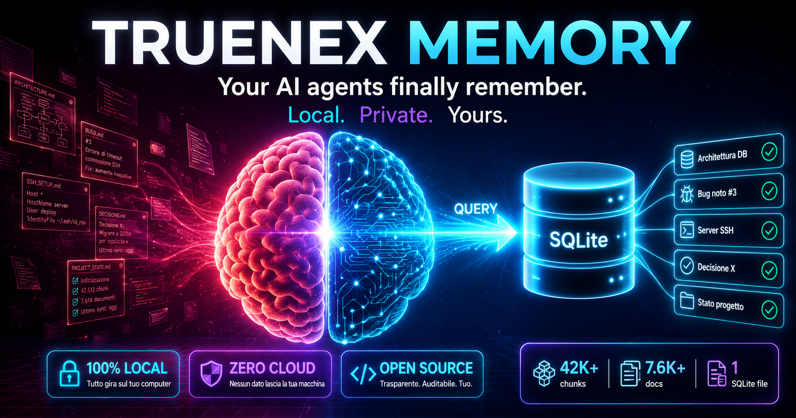
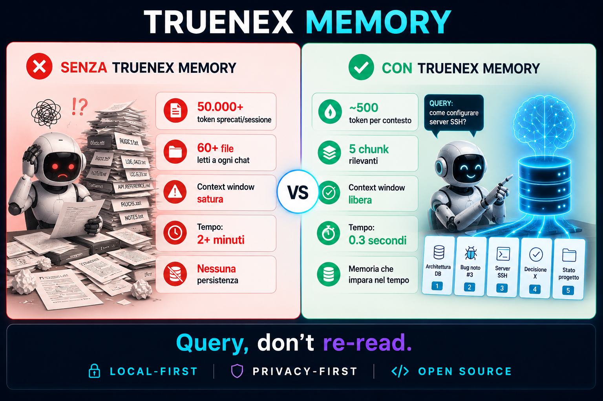
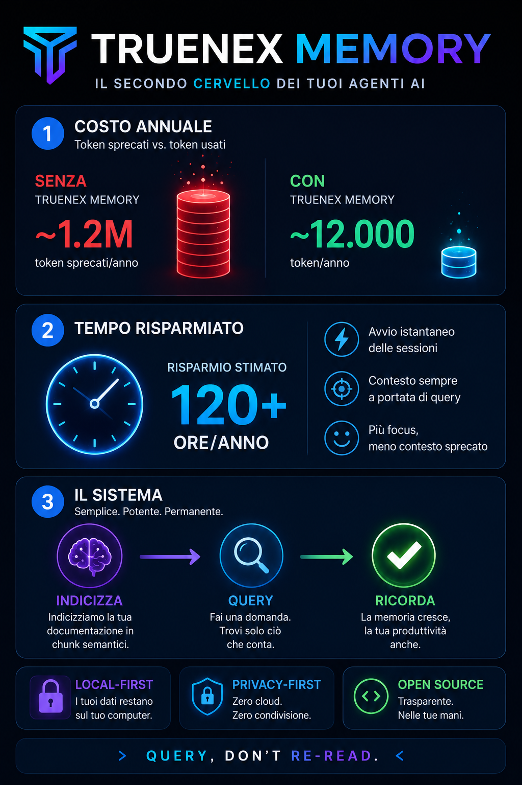

# Truenex Memory — Marketing & Pitch

> Materiale per Product Hunt, social media, pitch deck e comunicazione.

---

## Hero Image — Product Hunt

### Tagline

**Your AI agents finally remember. Local. Private. Yours.**

### Short Pitch (280 caratteri)

Ogni nuova chat col tuo AI agent spreca migliaia di token per rileggere documentazione che hai già pagato. Truenex Memory la indicizza una volta, poi l'agente fa una query e riceve solo i chunk rilevanti. Una query invece di 50 file. Centinaia di token invece di decine di migliaia.

---

## Social Media — Il Conto dei Token

### Didascalia per LinkedIn / Twitter

> **50.000 token sprecati a ogni sessione.**
>
> Non è un bug del tuo agente AI. È il costo dell'amnesia.
>
> Ogni volta che apri una nuova chat, l'agente rilegge TUTTA la documentazione del progetto. File su file. Token su token. Soldi su soldi.
>
> Con Truenex Memory, l'agente non legge più. **Chiede.** `memory_search("contesto")`. E riceve 5 chunk rilevanti. 500 token. Fine.
>
> Locale. Privato. Open source.
>
> [Link al repo]

### Didascalia breve (Instagram/Threads)

> 50.000 → 500. Non è magia, è Truenex Memory. Il secondo cervello per i tuoi agenti AI. 🧠

---

## Pitch Deck — Slide di Confronto

### Script per la presentazione

> "Ogni volta che iniziate una nuova chat con Claude Code o Codex, sapete cosa succede? L'agente rilegge tutto. Documentazione, log, decisioni passate. E voi pagate per ogni token."
>
> "Senza Truenex Memory: 50.000 token sprecati a sessione, context window satura di rumore, 2 minuti prima di iniziare a lavorare."
>
> "Con Truenex Memory: 500 token, 5 chunk precisi, 0.3 secondi. E il sistema impara nel tempo."
>
> "È locale, è privato, è open source. E fa risparmiare tempo e soldi dal primo giorno."

### Key Points per VC / Stakeholder

- **Problema validato:** ogni sviluppatore che usa AI agent vive il problema del contesto perso
- **Soluzione unica:** memory layer locale, non un altro cloud tool
- **Privacy-first:** nessun upload di codice, differenziazione competitiva
- **Trazione:** 42.000+ chunk, 7.600+ documenti in produzione
- **Business model:** open source core, potenziale enterprise (team server, audit)

---

## Infografica — Il Risparmio

### Dati per l'infografica

| Metrica | Senza TM | Con TM |
|---|---|---|
| Token/sessione | 50.000 | 500 |
| Token/anno (100 sessioni) | 5.000.000 | 50.000 |
| Tempo sprecato/sessione | 2+ minuti | 0.3 secondi |
| Ore risparmiate/anno | — | 120+ |
| File letti dall'agente | 60+ | 0 (query su indice) |

### ROI per sviluppatore

Con l'API Claude a $3/MTok input, 50.000 token/sessione × 100 sessioni/anno = 5M token/anno sprecati in riletture = **~$15/anno risparmiati**. Su un team di 10 sviluppatori: **$150/anno**. Su un'azienda di 100: **$1.500/anno**. Solo in token. Senza contare il tempo.

E Truenex Memory è gratuito e open source.

---

## Asset per il Lancio

### Product Hunt

- **Tagline:** Your AI agents finally remember. Local. Private. Yours.
- **Hero image:** `truenex-memory_2-6.png`
- **Description:** usa il [documento narrativo](narrativa.md)
- **First comment:** spiegazione tecnica rapida + link alla repo

### Social Media Kit

- **Quadrato 1080×1080:** `truenex-memory_2-7.png`
- **Slide orizzontale:** `truenex-memory_2-8.png`
- **Infografica verticale:** `truenex-memory_2-9.png`

### Sito / Landing Page

- **Hero section:** one-liner + `truenex-memory_2-6.png`
- **Problema/Soluzione:** illustrazioni `truenex-memory_2-3.png` e `truenex-memory_2-4.png`
- **Confronto:** `truenex-memory_2-5.png`
- **Come funziona:** diagramma `truenex-memory_7.png`

---

**Open Source · Apache 2.0 · Local-First · Privacy-First**
