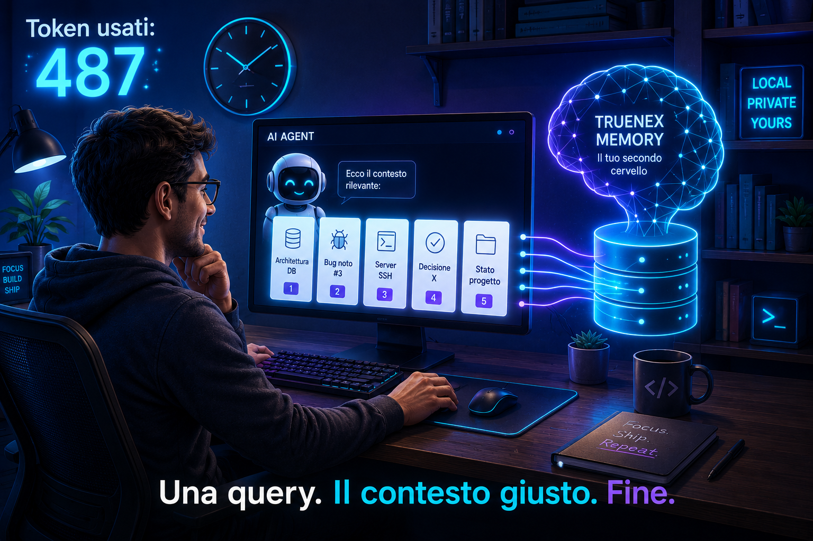
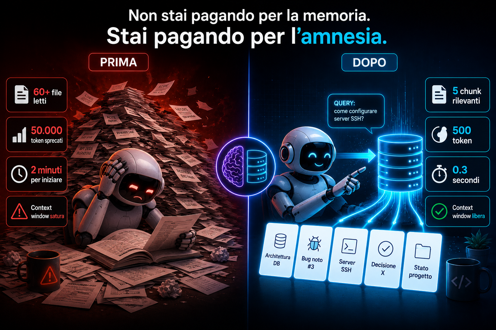
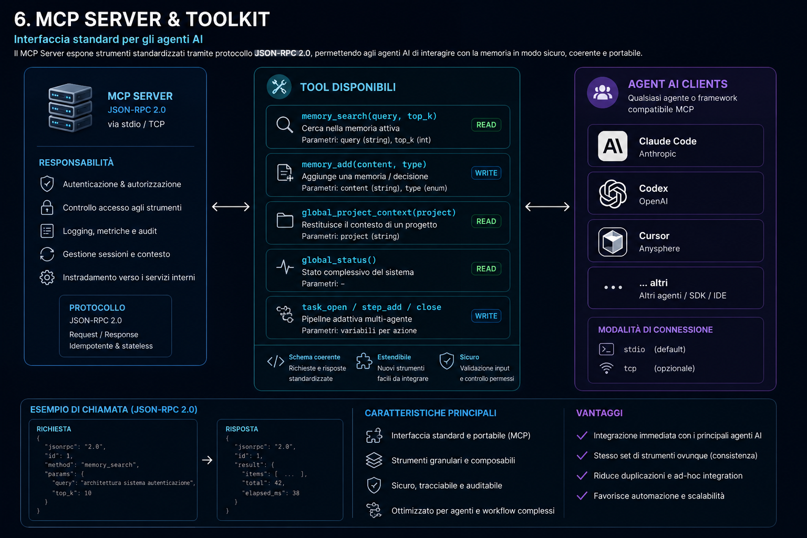

# Truenex Memory — Il Racconto

> La storia di come un agente AI ha smesso di dimenticare tutto a ogni sessione.

---

## Atto I — Il Problema

C'è un costo di cui nessuno parla quando si usano agenti AI per scrivere codice. Non è il canone mensile dell'API. Non è il tempo speso a fare prompt engineering. **È il costo del contesto perso.**

Ogni nuova chat con un AI agent ricomincia da zero. L'agente deve rileggere tutto: 60 file di documentazione, 150 log di sessione, 30 decisioni architetturali, 10 riferimenti a server. File su file. Decine di migliaia di token.

Non perché sia stupido. Perché non ha alternativa.

**Ogni sessione ricomincia con una tassa occulta.** Token bruciati in letture che hai già fatto, in decisioni che hai già preso, in bug che hai già risolto. Token che paghi. Token che rallentano le risposte. Token che tolgono spazio nella context window alle cose che ti servono davvero.

E la cosa peggiore? **Sono token sprecati per tornare al punto in cui eri già arrivato.**

---

## Atto II — La Soluzione

Truenex Memory è il pezzo mancante. È un "secondo cervello" che si installa in locale sulla tua macchina e fa da ponte tra i tuoi progetti e i tuoi agenti AI.

Funziona così. La prima volta che lo lanci, Truenex Memory scansiona — in modo intelligente e selettivo, solo le directory dei tuoi agenti, mai l'intero disco — e scopre da solo quali progetti hai, quali server usi, quali documenti sono rilevanti. Tu rivedi, confermi, ed è fatta.

Da quel momento, l'agente non legge più. Chiede. `memory_search("qual è il bug noto del router?")`. Il sistema restituisce 5 chunk classificati per rilevanza. L'agente ha il contesto che gli serve in **500 token invece di 50.000**.

La differenza non è solo comodità. È **tempo reale** — le risposte arrivano più veloci. È **denaro reale** — paghi solo i token che servono. È **qualità reale** — la context window respira.

---

## Atto III — Il Confronto

| | Senza Truenex Memory | Con Truenex Memory |
|---|---|---|
| **Documentazione** | 60+ file letti a ogni chat | 5 chunk rilevanti via query |
| **Token sprecati** | 50.000+ per sessione | ~500 per contesto |
| **Tempo** | 2+ minuti per "mettersi in pari" | 0.3 secondi |
| **Context Window** | Satura di rumore | Libera per il ragionamento |
| **Persistenza** | Nessuna. Ogni chat riparte da zero | Totale. L'agente ricorda tutto |

---

## Atto IV — Il Viaggio dell'Agente

Il ciclo completo in quattro passi:

1. **Discovery** — L'agente esplora le cartelle `.codex/` e `.claude/`. Trova progetti, documenti, server. Niente scansioni incontrollate del disco.

2. **Index** — Tutto viene parsificato, suddiviso in chunk, vettorizzato e salvato in SQLite. Una volta sola. Poi solo aggiornamenti incrementali.

3. **Query** — Inizia una nuova sessione. L'agente interroga il sistema invece di leggere tutto. Riceve esattamente i chunk che servono, classificati per rilevanza.

4. **Learn** — Il sistema genera automaticamente memorie dai contenuti ricorrenti. Tu approvi o rifiuti. La conoscenza si stratifica senza gonfiare l'indice.

---

## I Principi

- **100% Locale** — Un file SQLite nella tua home. Niente cloud, niente account, niente abbonamenti.
- **100% Privato** — Zero telemetria. Zero upload di codice o memoria. L'embedder è deterministico, nessun modello da scaricare.
- **100% Agent-First** — L'interfaccia è MCP stdio, lo stesso protocollo con cui l'agente parla al filesystem.
- **100% Tuo** — Export JSON completo. Se smetti di usarlo, i dati restano tuoi, in formato leggibile.

---

## Il Claim

> **Non stai pagando per la memoria del tuo agente. Stai pagando per la sua amnesia.**

---

**Open Source · Apache 2.0 · Local-First · Privacy-First**
