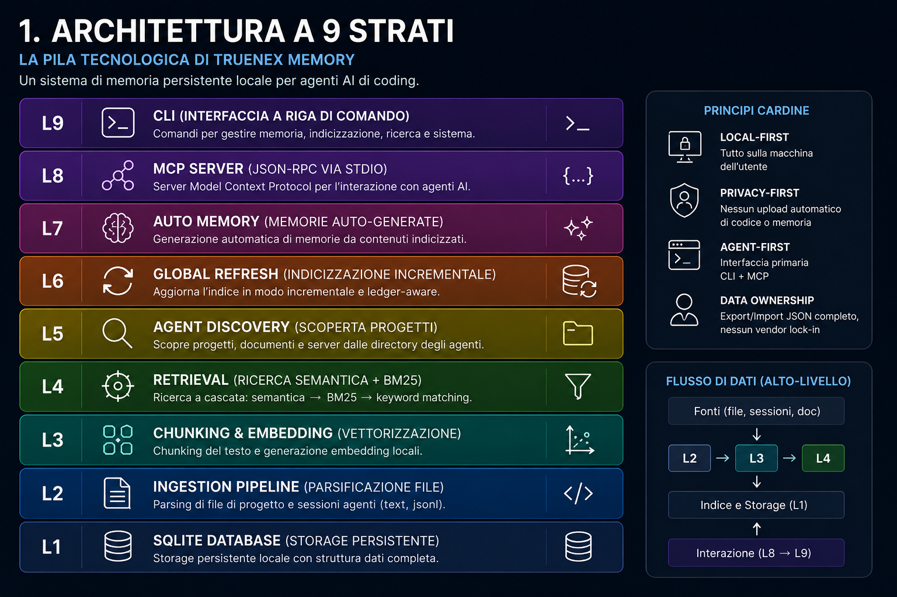
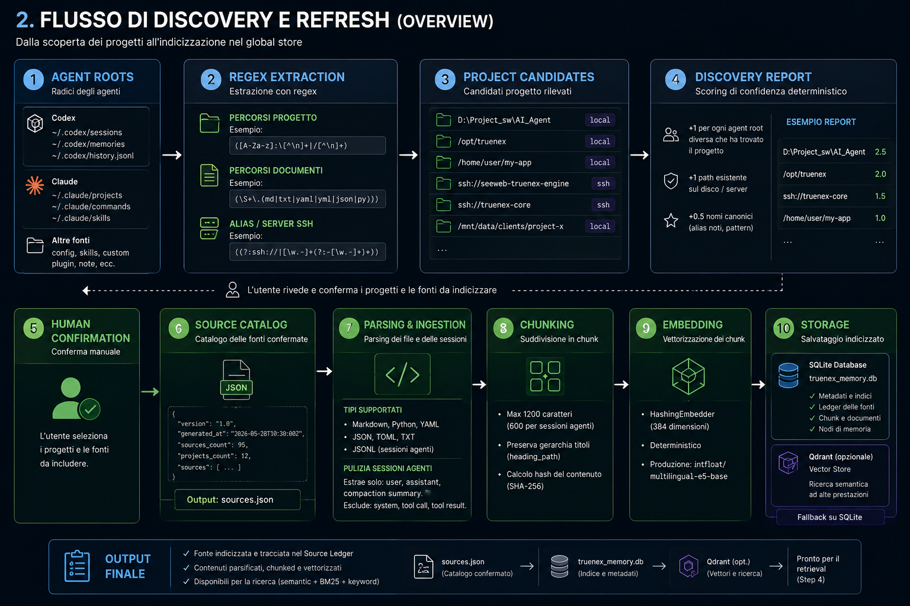
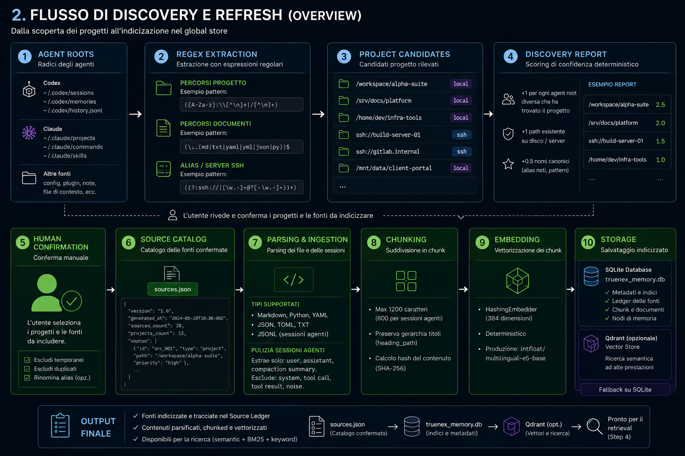
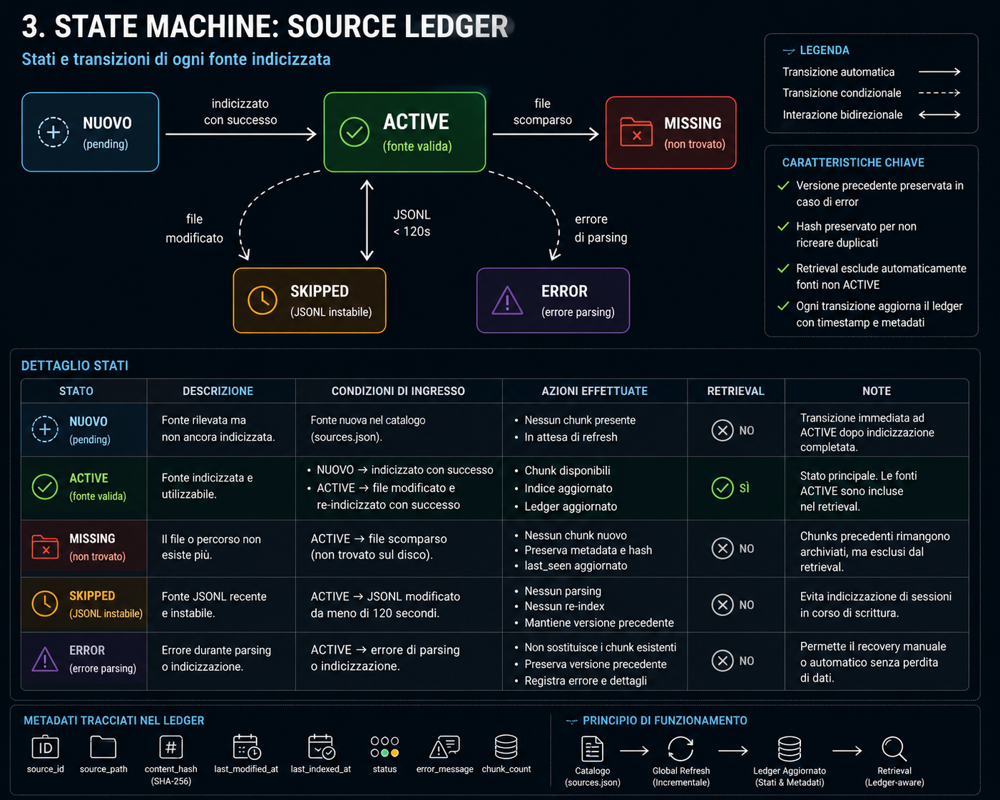
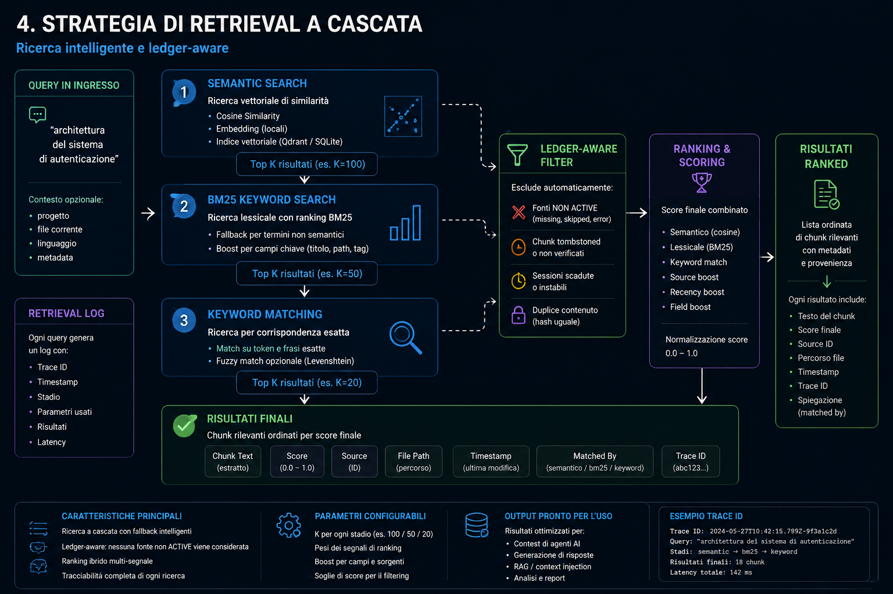
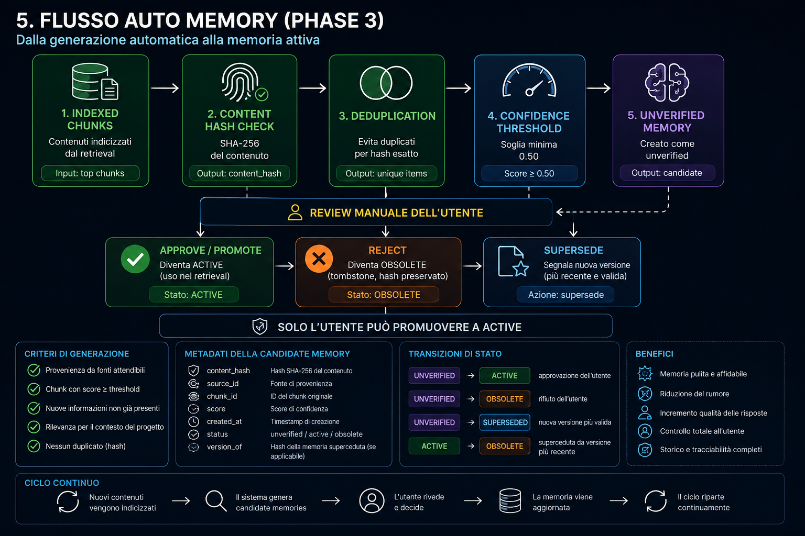
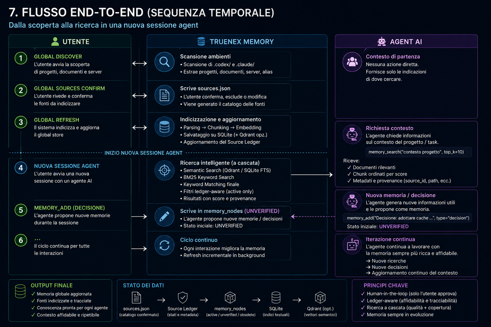
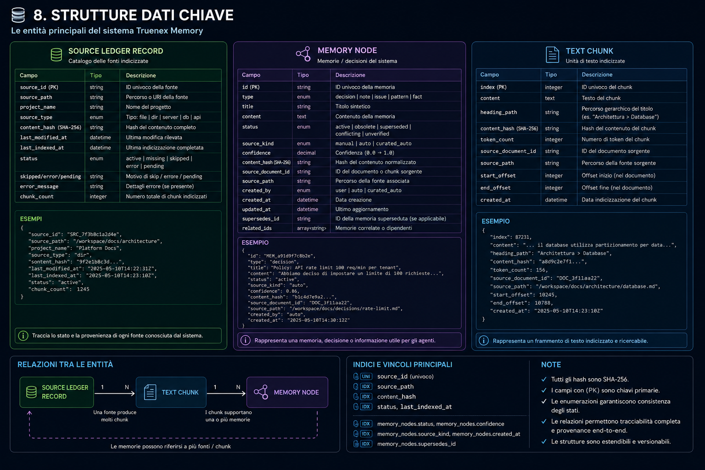
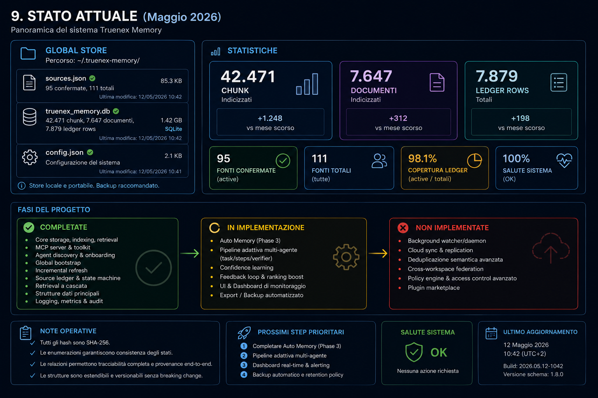

# Truenex Memory — Documento Tecnico

> Documentazione tecnica completa del memory layer per agenti AI.

---

## 1. Architettura a 9 Strati



Truenex Memory è organizzato in nove strati modulari, dal basso verso l'alto. Ogni strato dipende solo da quelli sottostanti.

### L1 — SQLite Database

Unico file `truenex_memory.db` in `~/.truenex-memory/`. Schema v4 con 9 tabelle:

```sql
documents       -- file indicizzati (path, content_hash, last_indexed_at)
chunks          -- frammenti con embedding (heading_path, qdrant_point_id)
memory_nodes    -- memorie con status, confidence, provenance
edges           -- relazioni tra nodi di memoria
retrieval_logs  -- log di ogni query (trace_id, results_json)
source_ledger   -- stato di ogni fonte: active|missing|skipped|error|pending
tasks           -- pipeline adattiva multi-agente
task_steps      -- step registrati per ogni task
verifier_rounds -- round di verifica per suggerimenti
```

### L2 — Ingestion Pipeline

Due parser: `text_docs` (`.md`, `.py`, `.yaml`, `.json`, `.toml`) e `jsonl_sessions` (log sessioni agenti). Il parser sessioni estrae solo richieste utente, risposte assistant e compaction summaries — esclude system messages, tool call, tool results.

### L3 — Chunking & Embedding

Chunking deterministico Markdown-aware: max 1200 char (600 per sessioni agenti), heading_path gerarchico. `HashingEmbedder` a 384 dimensioni, zero download di modelli, target production `intfloat/multilingual-e5-base`. Qdrant opzionale con fallback fails-closed su SQLite.

### L4 — Retrieval Engine

Strategia a cascata: semantica (cosine similarity) → BM25 keyword → keyword matching su memory_nodes. Filtro ledger-aware: esclude chunk da fonti `missing` e `skipped`. Ogni query produce un `RetrievalLog` con `trace_id`.

### L5 — Agent Discovery

Scansione confinata a `.codex/` e `.claude/`. Regex-based extraction di path, documenti, alias SSH. Confidence scoring deterministico. Zero blind disk scan.

### L6 — Global Refresh

Incrementale. State machine a 5 stati. Preserva la versione attiva su errore di re-indicizzazione. JSONL stability check: 120s configurabili.

### L7 — Auto Memory

Generazione automatica di memorie da chunk indicizzati. Deduplicazione per SHA-256. Soglia confidenza minima 0.50. Solo l'utente promuove a `active`. Tombstone per rigetto.

### L8 — MCP Server

JSON-RPC 2.0 via stdio. Tool: `memory_search`, `memory_add`, `global_project_context`, `global_status`, `task_open/step_add/close`.

### L9 — CLI

Comandi completi: `init`, `add`, `search`, `list`, `index`, `export`, `import`, `migrate`, `global discover/refresh/auto`, `doctor`, `mcp`.

---

## 2. Flusso di Discovery e Refresh



Il processo completo dalla scoperta all'indicizzazione:

1. **Agent Roots** — `.codex/` e `.claude/` come uniche fonti di discovery
2. **Regex Extraction** — path assoluti, alias SSH, documenti
3. **DiscoveryReport** — candidati classificati per confidence score
4. **Human Confirmation** — revisione e conferma utente
5. **sources.json** — Source Catalog (95 fonti confermate in produzione)
6. **Parser** — `text_docs` (MD, PY, YAML) + `jsonl_sessions`
7. **Chunking** — divisione in blocchi con heading_path
8. **Embedding** — vettori 384-dim, Qdrant opzionale
9. **Storage** — SQLite + Qdrant

---

## 3. State Machine del Source Ledger



Il Source Ledger è l'autorità per il comportamento incrementale.

### Stati

| Stato | Significato |
|---|---|
| `pending` | In coda per elaborazione (migrazioni) |
| `active` | Indicizzato e disponibile |
| `skipped` | Non indicizzabile / JSONL instabile |
| `missing` | File non più esistente su disco |
| `error` | Errore di parsing o indicizzazione |

### Regola Critica

> **Un errore di re-indicizzazione NON distrugge mai l'ultima versione attiva valida.** Il sistema preserva i dati indicizzati precedenti e riporta l'errore.

### Impatto sul Retrieval

```sql
SELECT c.* FROM chunks c
JOIN documents d ON d.id = c.document_id
LEFT JOIN source_ledger sl ON sl.source_path_or_alias = d.path
WHERE sl.source_id IS NULL OR sl.status NOT IN ('missing', 'skipped')
```

I chunk da fonti inaffidabili sono automaticamente esclusi.

---

## 4. Strategia di Retrieval a Cascata



```
INPUT: memory_search("bug router dual-model")

LIVELLO 1 — Ricerca Semantica
  Query vector → cosine similarity (Qdrant o SQLite)
  JOIN source_ledger (esclude missing/skipped)
  → Se risultati: RETURN classificati
  → Se 0 risultati: prosegue

LIVELLO 2 — BM25 Fallback
  Tokenizzazione → BM25 scoring + source_boost
  JOIN source_ledger
  → Se risultati: RETURN classificati
  → Se 0 risultati: prosegue

LIVELLO 3 — Keyword Matching
  Jaccard-like token overlap su memory_nodes (active + unverified)
  → RETURN classificati

OUTPUT: SearchHit[] con title, content, source_path, heading_path,
        memory_type, status, score + trace_id
```

---

## 5. Flusso Auto Memory



Generazione automatica di conoscenza dai contenuti indicizzati:

1. **Indexed Chunks** — contenuto candidato
2. **SHA-256 Hash** — calcolo hash del contenuto
3. **Deduplication** — skip se già presente come `active`
4. **Tombstone Check** — skip se `obsolete` con stesso hash
5. **Confidence Threshold** — minimo 0.50
6. **Classification** — decision / note / pattern
7. **Create Unverified** — `status='unverified'`, `source_kind='auto'`
8. **Human Review** — approve (active), reject (obsolete + tombstone), promote (curated_auto)

---

## 6. MCP Server e Toolkit



Server JSON-RPC 2.0 via stdio. Tool esposti:

| Tool | Descrizione |
|---|---|
| `memory_search(query, top_k)` | Ricerca semantica con score, provenance, trace_id |
| `memory_add(content, type)` | Nuova memoria o decisione |
| `global_project_context(project)` | Contesto completo di un progetto |
| `global_status()` | Report: catalog, ledger, chunks, warnings |
| `task_open/step_add/close` | Pipeline adattiva multi-agente |

Compatibile nativamente con Claude Code, Codex, Cursor.

---

## 7. Strutture Dati Chiave



### SourceLedgerRecord

Traccia lo stato di ogni file indicizzato: `source_id`, `source_path`, `project_name`, `source_type`, `content_hash` (SHA-256), `last_modified_at`, `status` (active/missing/skipped/error/pending), `error_message`, `chunk_count`.

### MemoryNode

Una memoria o decisione: `type` (decision/note/issue/pattern), `status` (active/obsolete/superseded/conflicting/unverified), `source_kind` (manual/auto/curated_auto), `content_hash`, `confidence` (0.0–1.0), provenance completa.

### TextChunk

Un frammento indicizzato: `content`, `heading_path` (es. "Architettura > Database"), `content_hash`, `token_count`.

---

## 8. Stato del Progetto



**Maggio 2026 — Global Store in produzione:**

```
~/.truenex-memory/
├── sources.json         (95 fonti confermate)
├── truenex_memory.db    (42.471 chunk, 7.647 documenti, 7.879 ledger rows)
└── config.json
```

- ✅ Core: storage, indexing, retrieval, MCP (Fasi 1-2)
- ✅ Discovery: agent roots, catalog, refresh incrementale (Fase 2.5)
- 🔄 Auto Memory: in implementazione (Fase 3)
- ⏸️ Watcher, cloud sync, semantic dedup (rimandati)

### Roadmap al Completamento



Visione target: tutte le funzionalità al 100%, watcher automatico, auto-memory matura, sistema pronto per produzione.

---

## Riferimenti

- [Truenex Memory Repository](https://github.com/marcomnit/truenex-memory)
- [One-Liner & Definizioni](one-liner.md)
- [Documento Narrativo](narrativa.md)
- [Documento Marketing](marketing.md)
